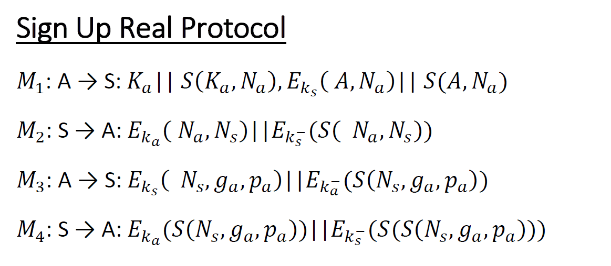

Protocols
****************
MPS Protocol is an End-to-End Encryption Suite of Protocols that establishes a
secure communication channel between 2 clients. The purpose of the server is just
to store clients information so that they can establish a secure session key,
that is unknown even to the server.

BAN Logic
`````````
:download:`Here <../BAN Logic/Protocollo E2EE 4.0.pdf>`
you can find the BAN logic analysis of the 4 protocols.


Sign Up Protocol
````````````````

The Sign Up Protocol describes the messages exchanged between Client and Server
in order to store into the Server's database the Client's Public Key and the Diffie
Hellman parameters. Every message, except M1, is signed using a RSA digital signature.

The Public Key :math:`K_{a}` in M1 is sent in plaintext because its size is too big to be encrypted
with RSA using the server's public key. Its integrity is guaranteed by :math:`S(K_{a}, N_{a})`,
that cannot be generated because the adversary doesn't know :math:`N_{a}`.  
The encrypted portion of M1 contains Alice's identifier, a nonce
that will be used to guarantee the freshness of M2 and the Alice's public key digest
to ensure its integrity.

M2 is just a notification that the server is ready to store Alice's information and
to do that it sends its nonce to ensure freshness of M3.

Alice now is ready to send her Diffie Hellman parameters :math:`g_{a}, p_{a}`.

The server sends back a digest ( less bytes, better performance ) of M3's data,
so that Alice can realize that the server has received the DH parameters.



Authentication Protocol
`````````````````````````
The Authentication Protocol must be executed every time a client logs into with
its credential, both to ensure its identity that to establish a session key with
the server and a session ID. Once the session key has been established, client
and server can communicate using a symmetric key algorithm, in this
case AES - Galois Counter Mode. This algorithm is able to provide both data authenticity
(integrity) and confidentiality, so there is no need to add any kind of signature
to packets encrypted with this algorithm. The Session ID is used to keep the communication
fresh in the others protocols.

.. image:: ../Img/Authentication.png

Online Key Exchange Protocol
`````````````````````````````
OKE Protocol is the core of this project, that is to make sure that Alice and Bob
have a symmetric session key that only they know. Obviously, in order to that, both Alice and
Bob must be online to exchange information and derive the key. Otherwise, if Bob is not
available, Alice and the server will go on with the Offline Communication Protocol.

Alice starts the protocol whenever she wants to talk with Bob, so she notifies that
to the server, sending the Bob's identifier and hers Session ID, in order to ensure
that this message comes from the current session.

The content of M2 differentiates the OKE from the Offline Communication Protocol.
Supposing Bob is online, the server sends to Alice the public key and the DH
parameters of Bob and, besides, it creates a packet that is supposed to be sent to Bob,
so that he can trust the content of that packet since the server is its source.
This packet contains the Alice's public key and her session ID, so that Bob can
answer to Alice in M4 and show her that this is the current session, and the Bob's
session ID with the same purpose.

Once Alice receives the Bob's DH parameters, she can compute a random number :math:`a`
in order to get the public parameter :math:`Y_{a} = g_{b}^amodp_{b}`. Then, she
sends to Bob :math:`Y_{a}` and the packet created to the server in M2.

Bob is now ready to compute his own public parameter :math:`Y_{b}`, so he computes
a random number :math:`b` and then :math:`Y_{b} = g_{b}^bmodp_{b}`. Having this
information, he can derive the symmetric key as :math:`K_{ab} = g_{b}^{ab}modp_{b}`.
He creates a packet contains the just computed public parameters, the Alice's
session ID and a nonce encrypted with the new symmetric key in order to prove to
Alice that he was able to compute the symmetric key.

After receiving :math:`Y_{b}`, also Alice can derive the symmetric key again as
:math:`K_{ab} = g_{b}^{ab}modp_{b}`. Now, she is able to decrypt the packet encrypted
by Bob with the :math:`K_{ab}` and get the nonce, that is sent back to Bob, so that
he can realize that Alice has the symmetric key as well.

Once both Alice and Bob have the symmetric key :math:`K_{ab}`, they can encrypt their
messages, adding a sequence number in order to avoid reordering attacks.

.. image:: ../Img/Online.png


Offline Communication Protocol
``````````````````````````````
As we said before, Alice can initiate a communication with Bob, without knowing if
he is available to talk. For this reason, OKE and this protocol share the same
first message M1.

Once the server realizes that Bob is not online, it sends to Alice the Bob's
public key :math:`K_{b}`, thus she can encrypt her data using it.

Whenever Alice has a message for Bob, she sends it to the server. Eventually, it
will delivery all the messages arrived when Bob executes the Authentication
Protocol. Replay attacks are not possible because the nonce needed by AES-GCM is
incremented every time, so if the received message is encrypted with an already used
nonce, the packet is discarded.


.. image:: ../Img/Offline.png
